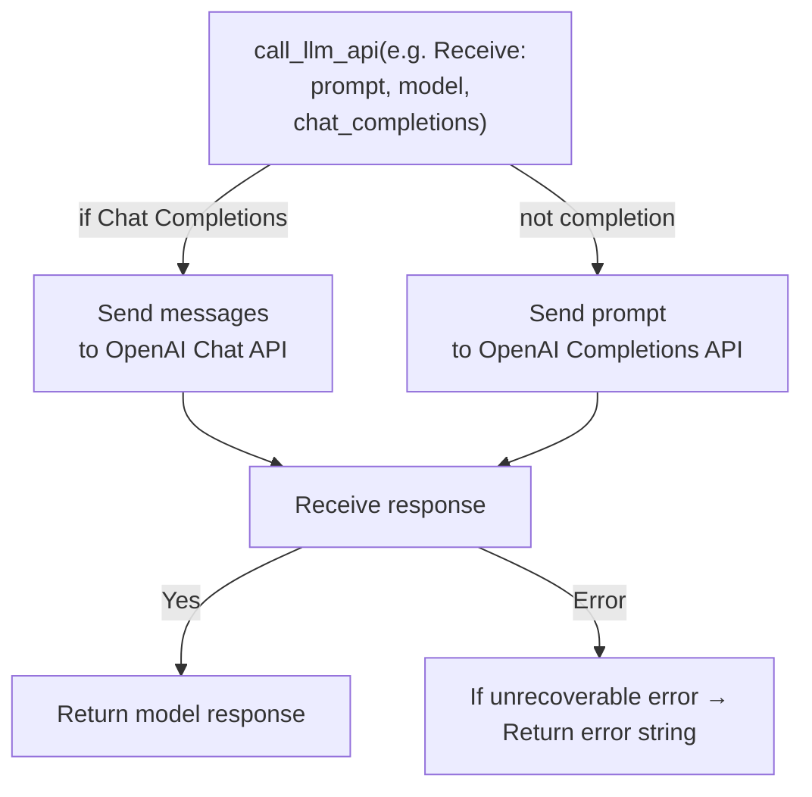
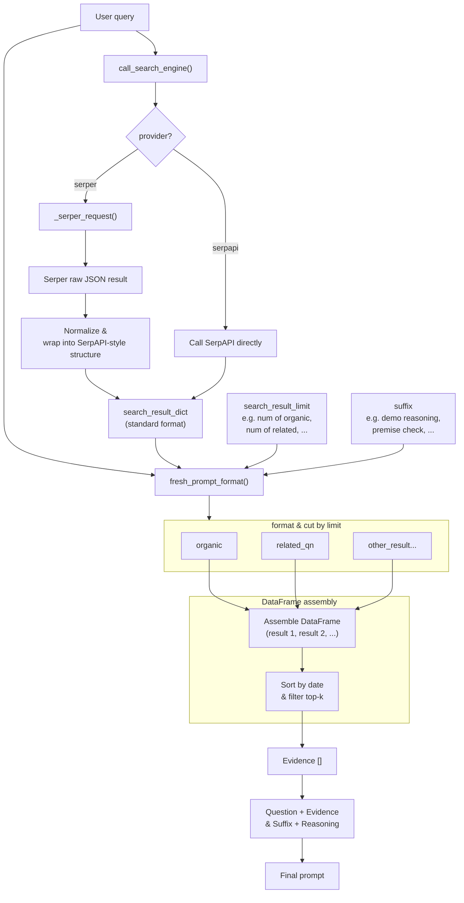

```mermaid
flowchart TD
call_api["call_llm_api(e.g. Receive:<br/>prompt, model, <br/>chat_completions)"]

call_api -- if Chat Completions --> chat_api["Send messages<br/>to OpenAI Chat API"]
call_api -- not completion  --> completion_api["Send prompt<br/>to OpenAI Completions API"]

chat_api --> receive_resp["Receive response"]
completion_api --> receive_resp

receive_resp -- Yes --> return_resp["Return model response"]
receive_resp -- Error --> error_check["If unrecoverable error →<br/>Return error string"]


```

```mermaid
flowchart TD

%% ======= (1) Search provider & normalization =======
user_query["User query"] --> call_search["call_search_engine()"]
call_search --> provider_check{"provider?"}

provider_check -- serpapi --> serpapi_call["Call SerpAPI directly"]
provider_check -- serper  --> serper_call["_serper_request()"]

serper_call  --> serper_json["Serper raw JSON result"]
serper_json  --> normalize["Normalize &amp;<br/>wrap into SerpAPI-style structure"]

%% unify output as search_data for next stage
normalize    --> search_data["search_result_dict<br/>(standard format)"]
serpapi_call --> search_data

%% ======= (2) Fresh Prompt Format pipeline =======
%% fpf takes both query text and search_data, plus config inputs
user_query --> fpf["fresh_prompt_format()"]
search_data --> fpf

result_limit["search_result_limit<br/>e.g. num of organic,<br/>num of related, ..."] --> fpf
suffix_cfg["suffix<br/>e.g. demo reasoning,<br/>premise check, ..."] --> fpf

%% split/cut by limits & formatting
fpf --> split_block
subgraph split_block["format &amp; cut by limit"]
    direction TB
    organic["organic"]
    related["related_qn"]
    other["other_result..."]
end


%% assemble into DataFrame
organic --> df_assembly
related --> df_assembly
other   --> df_assembly

subgraph df_block["DataFrame assembly"]
    direction TB
    df_assembly["Assemble DataFrame<br/>(result 1, result 2, ...)"]
    sort_topk["Sort by date<br/>&amp; filter top-k"]
end

df_assembly --> sort_topk
sort_topk   --> evidence["Evidence []"]

%% final stitching
evidence --> output["Question + Evidence<br/>&amp; Suffix + Reasoning"]
output   --> final_prompt["Final prompt"]
```
